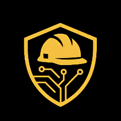

#  Protego - I Protect. The Shield for Workers.

A real-time Personal Protective Equipment (PPE) detection system using YOLOv8 and computer vision. This application helps monitor workplace safety by detecting safety equipment like helmets, vests, gloves, and other protective gear through webcam or video streams.

## ✨ Features

- 🎥 **Real-time Detection**: Live webcam feed with instant PPE detection
- 🚀 **High Performance**: Optimized detection intervals for smooth performance
- 🎯 **Accurate Recognition**: YOLOv8-based model for reliable PPE detection
- 📊 **Safety Logging**: Track and log safety violations
- 🌐 **Web Interface**: User-friendly browser-based interface
- ⚡ **WebSocket Communication**: Real-time bidirectional data streaming
- 🔧 **Customizable**: Adjustable detection parameters and thresholds

## 🎬 Demo

> **Add your demo video or GIF here**
>
> 

### Sample Detections

> **Add sample detection images here**
>
> | Input | Output |
> |-------|--------|
> |  |  |
> |  |  |

## 🛠️ Prerequisites

Before you begin, ensure you have the following installed on your system:

- **Python 3.11.9** (recommended for optimal compatibility)
- **Git** (for cloning the repository)
- **pip** (Python package installer)
- **Webcam/Camera** (for live detection)

### System Requirements

- **OS**: Linux, macOS, or Windows
- **RAM**: Minimum 4GB (8GB recommended)
- **Storage**: ~2GB for dependencies and models

## 📥 Installation

### 1. Clone the Repository

```bash
git clone https://github.com/yourusername/assistive_vision.git
cd assistive_vision
```

### 2. Set Up Python Environment

#### Create a Virtual Environment

```bash
# On Linux/macOS
python3.11 -m venv myenv
source myenv/bin/activate

# On Windows
python -m venv myenv
myenv\Scripts\activate
```

#### Verify Python Version

```bash
python --version
# Should output: Python 3.11.9
```

### 3. Install Dependencies

Navigate to the backend directory and install required packages:

```bash
cd backend
pip install --upgrade pip
pip install -r requirements.txt
```

**Note**: This will install:
- FastAPI & Uvicorn (Web framework)
- PyTorch (CPU version for deep learning)
- Ultralytics YOLO (Object detection)
- OpenCV (Computer vision)
- NumPy (Numerical computing)
- WebSockets (Real-time communication)

### 4. Verify Model Files

Ensure the YOLO model is present:

```bash
ls models/ppe_yolo.pt
```

If the model file is missing, you'll need to obtain it or train your own PPE detection model.

## 🚀 Usage

### Starting the Application

1. **Activate the virtual environment** (if not already activated):

```bash
# On Linux/macOS
source ../myenv/bin/activate

# On Windows
..\myenv\Scripts\activate
```

2. **Navigate to the backend directory**:

```bash
cd backend
```

3. **Start the server**:

```bash
uvicorn main:app --host 127.0.0.1 --port 8080
```

You should see output similar to:
```
📦 Loaded PPE classes: {0: 'Hardhat', 1: 'Mask', 2: 'NO-Hardhat', 3: 'NO-Mask', 4: 'NO-Safety Vest', 5: 'Person', 6: 'Safety Cone', 7: 'Safety Vest', 8: 'machinery', 9: 'vehicle'}
INFO:     Started server process [236606]
INFO:     Waiting for application startup.
INFO:     Application startup complete.
INFO:     Uvicorn running on http://127.0.0.1:8080 (Press CTRL+C to quit)
```

### Accessing the Application

1. Open your web browser
2. Navigate to: `http://localhost:8000`
3. Allow camera access when prompted
4. The live detection feed will start automatically

### Using the Interface

- **Start Detection**: The system automatically starts detecting PPE when you access the page
- **View Results**: Detected objects are highlighted with bounding boxes and labels
- **Safety Logs**: Violations and detections are logged in real-time
- **Stop Detection**: Simply close the browser tab or stop the server (CTRL+C)

## ⚙️ Configuration

You can customize the detection parameters in [`backend/main.py`](backend/main.py):

```python
# Performance Controls
DETECT_INTERVAL = 0.25      # Detection frequency (seconds)
RESULT_TTL = 0.6            # Result time-to-live (seconds)
JPEG_QUALITY = 65           # Image quality (1-100)
VIOLATION_COOLDOWN = 2.0    # Cooldown between violation alerts (seconds)
```

## 📁 Project Structure

```
assistive_vision/
├── backend/
│   ├── main.py              # FastAPI application & WebSocket server
│   ├── detector.py          # Detection logic (legacy/unused)
│   ├── requirements.txt     # Python dependencies
│   ├── Procfile            # Deployment configuration
│   ├── models/
│   │   └── ppe_yolo.pt     # YOLOv8 PPE detection model
│   └── static/
│       └── index.html      # Web interface
├── myenv/                   # Virtual environment (not in git)
├── runtime.txt             # Python version specification
├── LICENSE                 # Project license
└── README.md               # This file
```

## 🐛 Troubleshooting

### Common Issues

**1. Camera not accessible**
- Ensure your browser has permission to access the webcam
- Check if another application is using the camera
- Try a different browser (Chrome/Firefox recommended)

**2. Module not found errors**
```bash
# Ensure virtual environment is activated
source myenv/bin/activate  # Linux/macOS
myenv\Scripts\activate     # Windows

# Reinstall dependencies
pip install -r backend/requirements.txt
```

**3. Port already in use**
```bash
# Use a different port
uvicorn main:app --reload --port 8081
```

**4. Slow performance**
- Reduce `DETECT_INTERVAL` in main.py
- Lower `JPEG_QUALITY` for faster transmission
- Ensure CPU resources are available

## 🚢 Deployment

### Deploy Locally with Production Settings

```bash
uvicorn main:app --host 0.0.0.0 --port 8000 --workers 4
```

## 🤝 Contributing

Contributions are welcome! Please feel free to submit a Pull Request.

1. Fork the repository
2. Create your feature branch (`git checkout -b feature/AmazingFeature`)
3. Commit your changes (`git commit -m 'Add some AmazingFeature'`)
4. Push to the branch (`git push origin feature/AmazingFeature`)
5. Open a Pull Request

## 📄 License

This project is licensed under the terms specified in the [LICENSE](LICENSE) file.

## 👨‍💻 Author

**PrasanthPradeep**

## 🙏 Acknowledgments

- [Ultralytics YOLOv8](https://github.com/ultralytics/ultralytics) for the object detection framework
- [FastAPI](https://fastapi.tiangolo.com/) for the web framework
- [OpenCV](https://opencv.org/) for computer vision capabilities

## 📞 Support

If you encounter any issues or have questions:
- Open an [Issue](https://github.com/PrasanthPradeep/Protego/issues)

---

**⚠️ Safety Notice**: This system is designed to assist with safety monitoring but should not be relied upon as the sole method of ensuring workplace safety compliance. Always follow proper safety protocols and guidelines.
