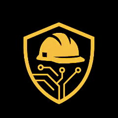

#  Protego - I Protect. The Shield for Workers.

A real-time Personal Protective Equipment (PPE) detection system using YOLOv8 and computer vision. This application helps monitor workplace safety by detecting safety equipment like helmets, vests, gloves, and other protective gear through webcam or video streams.

## ✨ Features

- 🎥 **Real-time Detection**: Live webcam feed with instant PPE detection & bounding boxes
- 🚀 **High Performance**: `requestAnimationFrame` frame dispatch & optimized detection intervals
- 🎯 **Accurate Recognition**: YOLOv8-based model for reliable PPE detection (Hardhat, Mask, Safety Vest)
- 📊 **Real-time Stat Cards**: Visual violation status badges (Safe / Violation) & category counters
- 🔊 **Voice Audio Alerts**: Web Speech API audio warnings with cooldown controls (`M` key toggle)
- 📜 **Live Incident Log**: Monospaced event stream with smooth fade-in animations
- 💻 **Single-Page Desktop Dashboard**: Minimalist, dark VC startup aesthetic fitted to a single non-scrollable screen
- ⚡ **WebSocket Communication**: Real-time bidirectional data streaming with auto-reconnect logic
- 🔧 **Customizable**: Adjustable detection parameters and thresholds

## 🎬 Demo

> **Add your demo video or GIF here**
>
> 

### Sample Detections

> **Add sample detection images here**
>
> | Input | Output |
> |-------|--------|
> |  |  |
> |  |  |

## 🛠️ Prerequisites

Before you begin, ensure you have the following installed on your system:

- **Python 3.11.x** (recommended for optimal compatibility)
- **Node.js & npm** (optional, for running via `npm start`)
- **Git** (for cloning the repository)
- **pip** (Python package installer)
- **Webcam/Camera** (for live detection)

### System Requirements

- **OS**: Linux, macOS, or Windows
- **RAM**: Minimum 4GB (8GB recommended)
- **Storage**: ~2GB for dependencies and models

## 📥 Installation

### 1. Clone the Repository

```bash
git clone https://github.com/PrasanthPradeep/protego.git
cd protego
```

### 2. Set Up Python Environment

#### Create a Virtual Environment

```bash
# On Linux/macOS
python3.11 -m venv myvenv
source myvenv/bin/activate

# On Windows
python -m venv myvenv
myvenv\Scripts\activate
```

### 3. Install Dependencies

Navigate to the backend directory and install required packages:

```bash
cd backend
pip install --upgrade pip
pip install -r requirements.txt
cd ..
```

**Note**: This will install FastAPI, Uvicorn, PyTorch, Ultralytics YOLO, OpenCV, NumPy, and WebSockets.

### 4. Verify Model Files

Ensure the YOLO model is present:

```bash
ls backend/models/ppe_yolo.pt
```

## 🚀 Usage

### Starting the Application

You can start the server using either **npm** or **Python**:

#### Option A: Using NPM (Recommended)
```bash
npm start
```
Or for auto-reload during development:
```bash
npm run dev
```

#### Option B: Using Uvicorn directly
```bash
cd backend
python -m uvicorn main:app --host 0.0.0.0 --port 8080
```

You should see output similar to:
```
📦 Loaded PPE classes: {0: 'Hardhat', 1: 'Mask', 2: 'NO-Hardhat', 3: 'NO-Mask', 4: 'NO-Safety Vest', 5: 'Person', 6: 'Safety Cone', 7: 'Safety Vest', 8: 'machinery', 9: 'vehicle'}
INFO:     Started server process [ ]
INFO:     Application startup complete.
INFO:     Uvicorn running on http://0.0.0.0:8080 (Press CTRL+C to quit)
```

### Accessing the Application

1. Open your web browser
2. Navigate to: `http://127.0.0.1:8080`
3. Allow camera access when prompted
4. The live detection feed will start automatically

### 🌐 Accessing from Mobile or Remote Devices over Internet

Browsers require **HTTPS** for camera permissions on remote devices:

```bash
# Using ngrok to generate a secure HTTPS tunnel
npx ngrok http 8080
```
Open the generated `https://xxxx.ngrok-free.app` URL on any phone or remote browser.

### Using the Interface

- **Live Video Feed**: Camera stream with real-time detection boxes
- **Stat Cards**: Real-time Safe/Violation badges for Hard Hat, Mask, and Safety Vest
- **Incident Log**: Auto-updating list of timestamped safety violations
- **Audio Alerts**: Voice warnings when violations occur (press **`M`** or click 🔊 to toggle)

## ⚙️ Configuration

You can customize the detection parameters in [`backend/main.py`](backend/main.py):

```python
# Performance Controls
DETECT_INTERVAL = 0.25      # Detection frequency (seconds)
RESULT_TTL = 0.6            # Result time-to-live (seconds)
JPEG_QUALITY = 65           # Image quality (1-100)
VIOLATION_COOLDOWN = 2.0    # Cooldown between violation alerts (seconds)
```

## 📁 Project Structure

```
protego/
├── backend/
│   ├── main.py              # FastAPI application & WebSocket server
│   ├── detector.py          # Detection logic (legacy/unused)
│   ├── requirements.txt     # Python dependencies
│   ├── Procfile             # Deployment configuration
│   ├── models/
│   │   └── ppe_yolo.pt      # YOLOv8 PPE detection model
│   └── static/
│       └── index.html       # Web interface (Single-page dashboard)
├── package.json             # NPM scripts (start, dev)
├── package-lock.json        # NPM lockfile
├── myvenv/                  # Virtual environment (ignored by git)
├── LICENSE                  # Project license
└── README.md                # Documentation
```

## 🐛 Troubleshooting

### Common Issues

**1. Camera not accessible**
- Ensure your browser has permission to access the webcam
- HTTPS is required when accessing from external/remote devices

**2. Port already in use**
```bash
# Clear process using port 8080
fuser -k 8080/tcp
```

**3. Module not found errors**
```bash
# Ensure virtual environment is activated and requirements installed
source myvenv/bin/activate
pip install -r backend/requirements.txt
```

## 📄 License

This project is licensed under the terms specified in the [LICENSE](LICENSE) file.

## 👨‍💻 Author

**PrasanthPradeep** (https://github.com/PrasanthPradeep/)

## 🙏 Acknowledgments

- [Ultralytics YOLOv8](https://github.com/ultralytics/ultralytics) for object detection
- [FastAPI](https://fastapi.tiangolo.com/) for the web framework
- [OpenCV](https://opencv.org/) for computer vision capabilities

---

**⚠️ Safety Notice**: This system is designed to assist with safety monitoring but should not be relied upon as the sole method of ensuring workplace safety compliance. Always follow proper safety protocols and guidelines.
